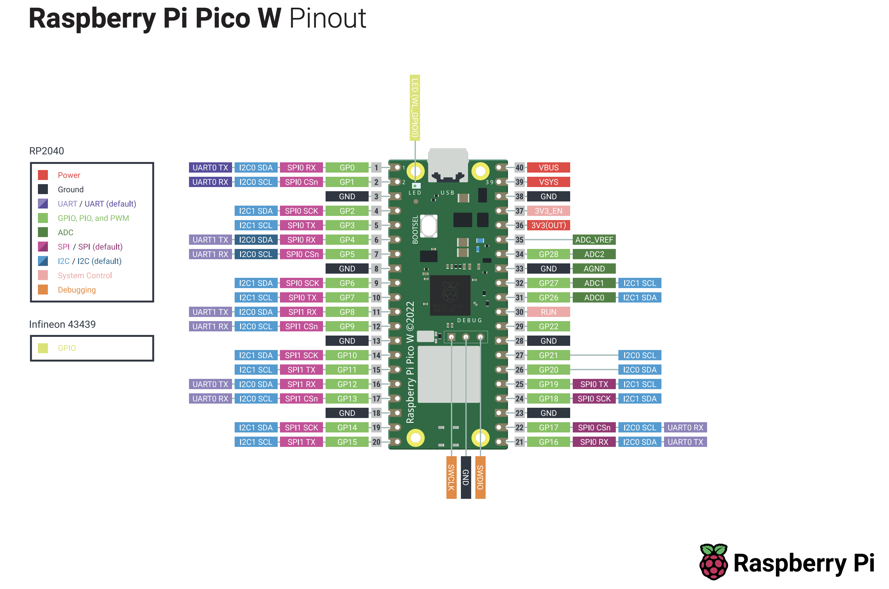

Supported Protocols
===

## Resources

- [RPI Pico W Pinout](https://datasheets.raspberrypi.com/picow/PicoW-A4-Pinout.pdf)
- [protocol explanations](https://electronics.stackexchange.com/a/37817)

## SPI Pins

Serial Peripheral Interface is another very simple serial protocol. A master sends a clock signal, and upon each clock pulse it shifts one bit out to the slave, and one bit in, coming from the slave. Signal names are therefore SCK for clock, MOSI for Master Out Slave In, and MISO for Master In Slave Out. By using SS (Slave Select) signals the master can control more than one slave on the bus. There are two ways to connect multiple slave devices to one master, one is mentioned above i.e. using slave select, and other is daisy chaining, it uses fewer hardware pins (select lines), but software gets complicated.

- `SPIx SCK`: clock signal
- `SPIx TX`: (MISO - Master In Slave Out) output
- `SPIx RX`: (MOSI - Master Out Slave In) input
- `SPIx CSn`: (Slave Select/Chip Select) You can have multiple slaves on the SPI bus. The master asserts the chip select line of the slave he wants to communicate with.

## UART Pins

Universal Asynchronous Receiver Transmitter, is one of the most used serial protocols. It's almost as old as I am, and very simple. Most controllers have a hardware UART on board. It uses a single data line for transmitting and one for receiving data. Most often 8-bit data is transferred, as follows: 1 start bit (low level), 8 data bits and 1 stop bit (high level). The low level start bit and high level stop bit mean that there's always a high to low transition to start the communication. That's what describes UART. No voltage level, so you can have it at 3.3 V or 5 V, whichever your microcontroller uses. Note that the microcontrollers which want to communicate via UART have to agree on the transmission speed, the bit-rate, as they only have the start bits falling edge to synchronize. That's called asynchronous communication.

For long distance communication (That doesn't have to be hundreds of meters) the 5 V UART is not very reliable, that's why it's converted to a higher voltage, typically +12 V for a "0" and -12 V for a "1". The data format remains the same. Then you have RS-232 (which you actually should call EIA-232, but nobody does.)

The timing dependency is one of the big drawbacks of UART, and the solution is USART, for Universal Synchronous/Asynchronous Receiver Transmitter. This can do UART, but also a synchronous protocol. In synchronous there's not only data, but also a clock transmitted. With each bit a clock pulse tells the receiver it should latch that bit. Synchronous protocols either need a higher bandwidth, like in the case of Manchester encoding, or an extra wire for the clock, like SPI and I2C.

- `UARTx TX`:
- `UARTx RX`:

## I2C Pins

Inter-Integrated Circuit (pronounced "I squared C") is also a synchronous protocol, and it's the first we see which has some "intelligence" in it; the other ones dumbly shifted bits in and out, and that was that. I2C uses only 2 wires, one for the clock (SCL) and one for the data (SDA). That means that master and slave send data over the same wire, again controlled by the master who creates the clock signal. I2C doesn't use separate Slave Selects to select a particular device, but has addressing. The first byte sent by the master holds a 7 bit address (so that you can use 127 devices on the bus) and a read/write bit, indicating whether the next byte(s) will also come from the master or should come from the slave. After each byte, the receiver must send a "0" to acknowledge the reception of the byte, which the master latches with a 9th clock pulse. If the master wants to write a byte, the same process repeats: the master puts bit after bit on the bus and each time gives a clock pulse to signal that the data is ready to be read. If the master wants to receive data it only generates the clock pulses. The slave has to take care that the next bit is ready when the clock pulse is given. This protocol is patented by NXP (formerly Phillips), to save licensing cost, Atmel using the word TWI (2-wire interface) which exactly same as I2C, so any AVR device will not have I2C but it will have TWI.

Two or more signals on the same wire may cause conflicts, and you would have a problem if one device sends a "1" while the other sends a "0". Therefore the bus is wired-OR'd: two resistors pull the bus to a high level, and the devices only send low levels. If they want to send a high level they simply release the bus.

- `I2Cx SDA`:
- `I2Cx SDL`:

## GPIO/PIO/PWM Pins

- `GPx`: Good for turning on/off a few I-O ports. If all that is needed is control of a solid state relay or two for example, this is it. You could bit bang I2C or SPI but why would you when real I2C or SPI is available?

## ADC Pins

- `ADCx`:
- `ADCGND`:
- `ADC_VREF`:
