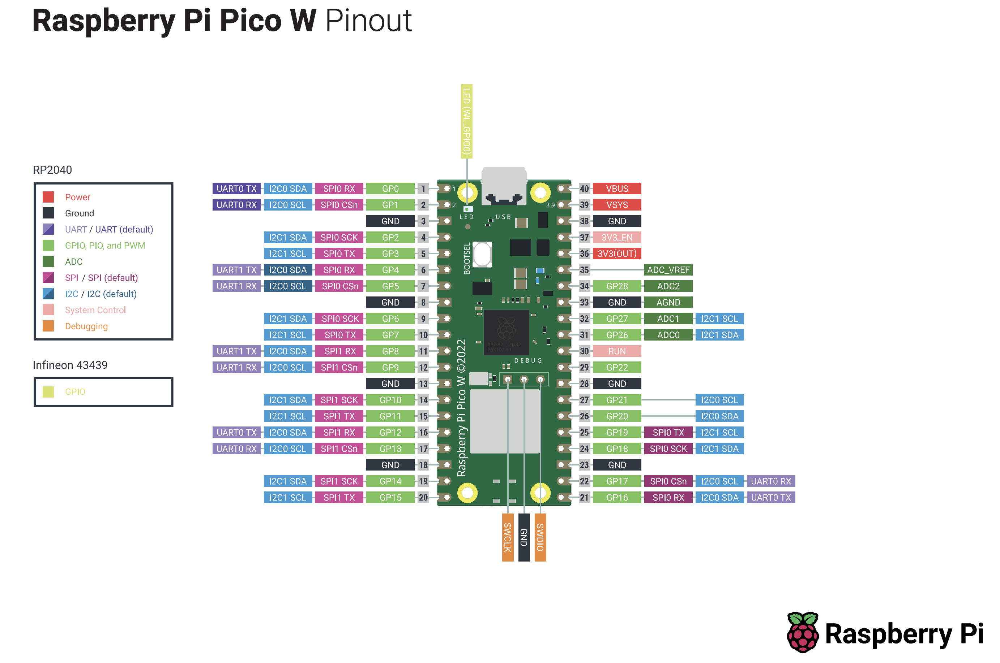

Raspberry Pi Pico
====

> [!WARNING]
> !!!!!!!!!!!!!!!!!!!!!!!!!!!!!!!!!!!!!!!!!!!!!!!!!!!!!!!!
> !   TinyGo won't work on the RPI Pico W : [see issue](https://github.com/tinygo-org/tinygo/issues/2947)
> !!!!!!!!!!!!!!!!!!!!!!!!!!!!!!!!!!!!!!!!!!!!!!!!!!!!!!!!
>

## Prerequisites

- install TinyGo as specified in the [documentation](https://tinygo.org/getting-started/install/)
- install Visual Studio Code extentions
  - [TinyGo](https://marketplace.visualstudio.com/items?itemName=tinygo.vscode-tinygo)

## Power

- if the pico is powered throuth the USB port, you MAY use the `VBUS` pin to provide 5V to some low power load.
- if the power draw is to great, you MUST use a secondary power source for the LED strip

## Pins Layout

### LED Strip Connections

- `RED (+ 5V)`: has to be connected to `pin 40 (VBUS)` and the power source `positive`
- `BLACK (-)`: has to be connected to `pin 38 (GND)`and the power source `negative`
- `YELLOW (SPI SCK)`: clock signal may be connected to `pin 4 (SPI0 SCK)`
- `GREEN (MISO)`:  Master In Slave Out (output signal) may be connected to `pin 5 (SPI0 TX)`

### Power/Dimmer Potentiometer

- `RED (+ 3.3V)`: potentiometer outer pin 1 has to be connected to `pin 36 (OUT)`
- `BLACK (-)`: potentiometer outer pin 2 has to be connected to `pin 38 (GND)`and the power source `negative`
- `BROWN (Wiper)`: potentiometer middle pin may be connected to `pin 34 (ADC2)`

## Resources

- [RPI Pico W Pinout](https://datasheets.raspberrypi.com/picow/PicoW-A4-Pinout.pdf)
- [RPI Pico 5V Output](https://raspberrypi.stackexchange.com/a/127865)
- [SK9822 Strip Manual](https://cdn-learn.adafruit.com/downloads/pdf/adafruit-dotstar-leds.pdf)
- [SK9822 Strip Dataframes](https://cdn-shop.adafruit.com/product-files/2343/SK9822_SHIJI.pdf)
- [tutorial](https://github.com/tinue/apa102-pi)
- [RPI potentiometer analog to digital](https://how2electronics.com/how-to-use-adc-in-raspberry-pi-pico-adc-example-code/)
- [protocol explanations](https://electronics.stackexchange.com/a/37817)

